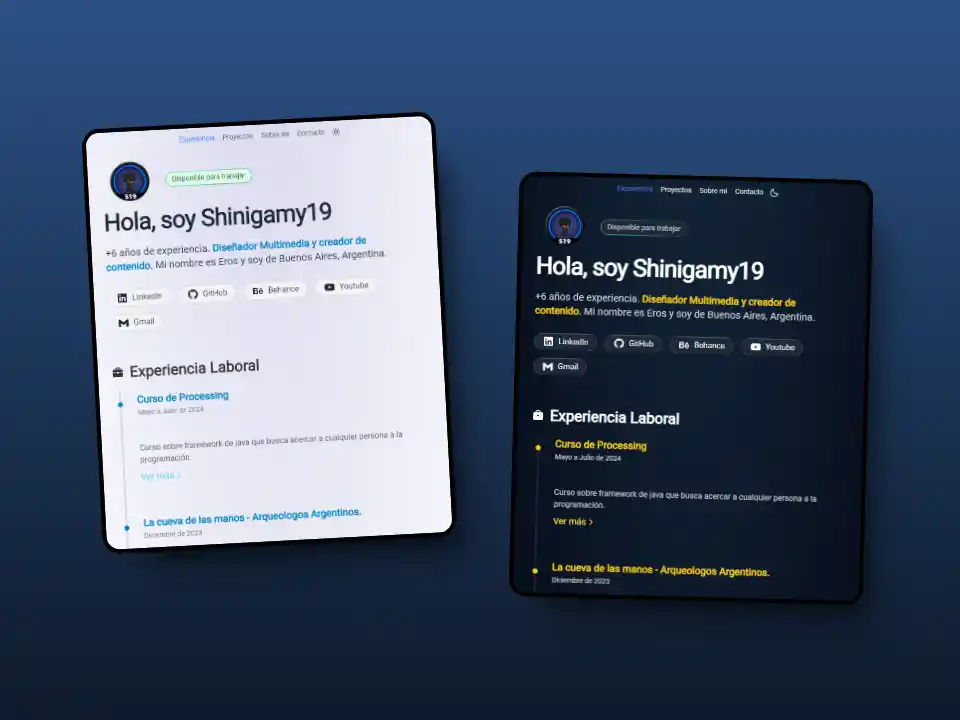
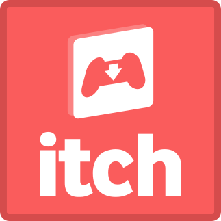

# 👨‍💻 Portfolio Profesional - Shinigamy19

¡Bienvenido al repositorio de mi portafolio personal! Este proyecto es una aplicación web moderna, rápida y responsiva diseñada para mostrar mi experiencia, habilidades, cursos y proyectos como Desarrollador Fullstack y Diseñador Multimedia.

Este portafolio ha sido construido utilizando las últimas tecnologías web para asegurar un rendimiento excepcional y una gran experiencia de usuario.

---

## 🚀 Características Principales

- **⚡ Rendimiento de Alto Nivel:** Construido con **Astro 5**, garantizando tiempos de carga ultrarrápidos y una optimización SEO excelente.
- **🎨 Diseño Moderno y Responsivo:** Estilizado con **Tailwind CSS** para adaptarse perfectamente a dispositivos móviles, tablets y escritorio.
- **🌍 Internacionalización (i18n):** Soporte completo para múltiples idiomas (Español e Inglés), detectando y permitiendo cambiar el idioma fácilmente.
- **🌓 Tema Oscuro/Claro:** Implementación de modo oscuro y claro respetando las preferencias del sistema del usuario.
- **📄 Gestión de Documentos:** Integración inteligente con Google Drive para la visualización directa de certificados y CVs sin descargas innecesarias.
- **📱 Contacto Interactivo:** Enlaces directos a WhatsApp y correo electrónico para una comunicación fluida.

---

## 🛠️ Tecnologías Utilizadas

Este proyecto aprovecha un stack tecnológico robusto y moderno:

- **Framework:** [Astro](https://astro.build/) (v5)
- **Lenguaje:** [TypeScript](https://www.typescriptlang.org/)
- **Estilos:** [Tailwind CSS](https://tailwindcss.com/)
- **Iconos:** SVG personalizados y componentes optimizados.
- **Despliegue:** Netlify / Vercel (Compatible)

## 📬 Contacto y Redes Sociales

Si te interesa mi trabajo o quieres contactarme, puedes encontrarme en:

<h3 align="center">Mis redes sociales:</h3>

---

## ☕ Apoya mi trabajo

Si te gusta mi contenido o mis proyectos te han sido útiles, puedes invitarme un café o realizar una donación. ¡Se agradece mucho!

